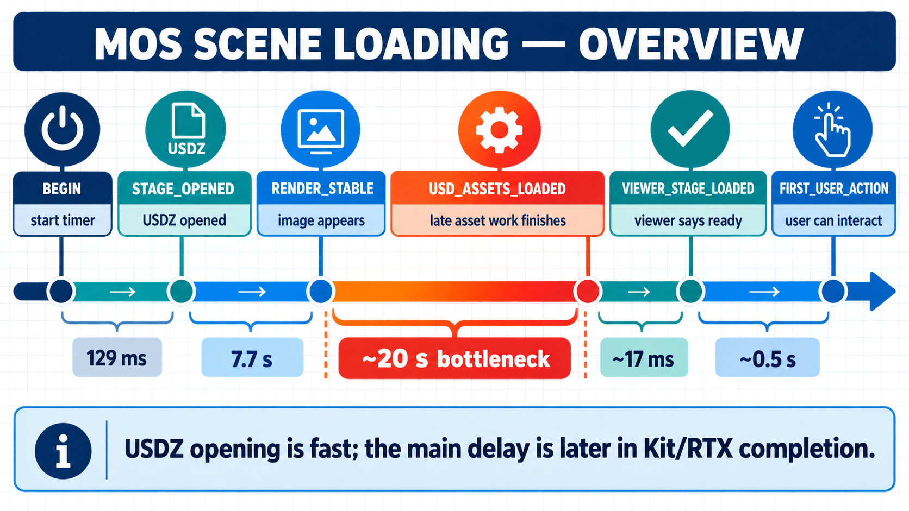

# MOS scene loading: current knowledge

_Last consolidated 2026-08-20 from source code, Kit logs, activity traces, and controlled runs._




## The short answer

The USDZ file itself opens quickly. The long delay happens later, after MOS already has an active stage and after the viewport can produce a stable-looking image.

For the latest one-scene run:

- USDZ stage open: **129 ms**
- First stable captured render: **7.726 s**
- Kit's `USD_ASSETS_LOADING → USD_ASSETS_LOADED`: **19.610 s** after `RENDER_STABLE`
- First user action: **27.829 s** after scene `BEGIN`

The exact owner of the final 19.610 seconds is not yet exposed by the current instrumentation. The evidence points at Kit's RTX/graphics synchronization and streaming-completion path, not ordinary disk bandwidth.

## What happens when MOS loads a scene

```text
Next / scene selection
  ↓
MOS BEGIN                         application timer starts
  ↓
Close old stage and open USDZ
  ↓
STAGE_OPENED                      USDZ is the active Kit stage
  ↓
Orientation, camera, navigation   MOS-side setup
  ↓
FIRST_PRESENT_TO_VIEWPORT         renderer presents a viewport frame
  ↓
RENDER_STABLE                     captured frames stop changing
  ↓
USD_ASSETS_LOADING                Kit begins/announces late asset work
  ↓
USD_ASSETS_LOADED                 Kit announces asset completion
  ↓
STREAMING_GATE_CLEAR              viewer releases its completion gate
  ↓
VIEWER_STAGE_LOADED               viewer announces completion
  ↓
FIRST_USER_ACTION                 MOS receives keyboard/mouse input
```

These are not interchangeable meanings of “ready.” `STAGE_OPENED` means the stage exists. `RENDER_STABLE` means the captured image stopped changing. `FIRST_USER_ACTION` is the strongest participant-facing reference, although it includes the participant's reaction time.

## Latest measured timeline

Source: Kit log `kit_20260817_232351.log`, scene `generated_3dgs_opt.usdz`, local SSD mirror, Kit 110.2.0, single-GPU configuration.

| Time from scene `BEGIN` | Checkpoint | Meaning |
|---:|---|---|
| 0 ms | `BEGIN` | MOS starts the scene transition timer. |
| 1 ms | `VIEWPORT_CAPTURE_REQUESTED` | Baseline viewport capture requested. |
| 97 ms | `USD_OPENING` | Target stage-opening lifecycle begins. |
| 99 ms | `omni.usd` opened successfully | Kit reports the USDZ open call complete. |
| 129 ms | `STAGE_OPENED` | Requested USDZ is active. |
| 129 ms | `ORIENTATION_DONE` | Orientation work completed. |
| 131 ms | `CAMERA_READY` | `cameras.json` camera applied. |
| 132 ms | `NAV_READY` | Navigation state restored. |
| 132 ms | `FIRST_PRESENT_TO_VIEWPORT` | Renderer presented a frame. |
| 133 ms | `POST_PRESENT_FRAME_BUFFER` | Presentation path completed. |
| 134 ms | `FIRST_POST_LOAD_UPDATE` | MOS returned to the Kit update loop. |
| 183 ms | `VIEWPORT_BASELINE_CAPTURED` | Baseline image captured. |
| 7.087 s | `STREAMING_IDLE` / `USD_ASSETS_LOADING` | Late asset-loading phase is announced. |
| 7.090–7.091 s | MDL activity messages | Three MDL assets report progress `1.0`. |
| 7.380–7.726 s | viewport samples 1–3 | Captured image remains unchanged. |
| 7.726 s | `RENDER_STABLE` | Stable-image criterion passes. |
| **7.726–27.336 s** | **no detailed activity checkpoint** | **20.610 s remains unassigned.** |
| 27.336 s | `USD_ASSETS_LOADED` | Kit reports assets loaded. |
| 27.339 s | `STREAMING_GATE_CLEAR` | Viewer completion gate releases. |
| 27.353 s | `VIEWER_STAGE_LOADED` | Viewer sends its final stage-loaded signal. |
| 27.829 s | `FIRST_USER_ACTION` (`W`) | MOS receives the first deliberate input. |

## What is inside the slow interval?

The latest Kit activity file is:

```text
/home/pierce/.cache/ov/Kit/110.2/698af100/activities/generated_3dgs_opt.activity
```

It provides one useful active span:

- `Render Thread / Post Sync`: **6.984 s**

The same activity trace records material work, but it is short:

- MDL compile spans: roughly **1–4 ms** each
- MDL shader-variation spans: roughly **7–10 ms** each
- Fabric-population spans: roughly **1–3 ms** each

After the recorded render-thread synchronization span, the activity trace has a large period without a named activity node. The log likewise has no finer-grained completion event between the MDL progress messages around +7.09 s and `USD_ASSETS_LOADED` at +27.336 s.

Therefore the honest current conclusion is:

> The 20.610-second wait is real, but the current traces do not name the operation responsible for it. It is most likely an internal Kit RTX/graphics-streaming synchronization or completion wait, but that remains a hypothesis until a driver-level graphics trace or narrower Kit instrumentation identifies the blocked call.

`USD_ASSETS_LOADED` is a Kit lifecycle signal; it is not a direct timestamp for the last byte read from the USDZ file.

## Evidence that rules out simpler explanations

### USDZ opening and basic MOS setup

The target USDZ opened successfully in about 2 ms according to `omni.usd`, and the full `BEGIN → STAGE_OPENED` interval was 129 ms. Orientation, camera, and navigation each completed within this same short interval.

### NAS versus SSD

The controlled matched-scene A/B found nearly identical asset-loading durations:

| Source | Median `USD_ASSETS_LOADING → USD_ASSETS_LOADED` |
|---|---:|
| NAS | 20.681 s |
| Local SSD | 20.944 s |

The SSD result was about 263 ms slower in the median, so moving the file to SSD did not remove the bottleneck. This was app-cold rather than a forced disk-cold benchmark, so it does not prove that the NAS is intrinsically faster.

### Vulkan and CUDA traces

The valid Vulkan trace showed only a few milliseconds of Vulkan work per second during the approximately 20-second interval, with no large Vulkan workload explaining it. A CUDA-plus-Vulkan trace showed no CUDA kernels or CUDA memory-copy operation lasting 20 seconds; it mainly captured short external-memory interop calls.

The earlier Kit CPU activity trace did capture a roughly 20.7-second nested wait:

```text
RtxHydraEngine::endFrame
  Render graph command submission
    CUDA submit / CUDA command
      CommandList::waitForLastSubmission
```

This localizes the wait to Kit's graphicsmux/RTX submission path, but it does not reveal what the backend or driver is waiting for.

### GPU utilization and memory

During an unprofiled 19.749-second asset-loading interval:

- GPU utilization averaged 5% and peaked at 19%.
- VRAM ranged from 4.45 to 5.56 GB of 32 GB.
- Board power ranged from 51.6 to 79 W.
- No sample was GPU-saturated at 90% or higher.

This makes ordinary GPU saturation and VRAM exhaustion unlikely explanations.

## Configuration changes and their effect

- Kit was upgraded from **110.0.0** to **110.2.0**.
- MOS was changed to `renderer.multiGpu.enabled = false` because the machine exposes one relevant NVIDIA GPU.
- The single-GPU A/B improved the matched interval from **20.852 s** to **19.591 s**, about **6%**, but did not solve it.
- A cold-start RTX PSO compilation hang was observed after the upgrade. Adding asynchronous shader-finalization settings made the participant prompt usable again, reducing startup to about 3 seconds. It did **not** reduce the scene's post-render asset-loading delay.

## Current bottleneck ranking

1. **Highest confidence:** a nearly fixed post-render Kit RTX/graphics synchronization or completion wait.
2. **Possible but not proven:** driver/backend interaction specific to the RTX 5090/Blackwell path.
3. **Lower confidence:** USDZ disk I/O or NAS bandwidth, because NAS and SSD matched closely.
4. **Low confidence for this run:** ordinary MDL compilation, Vulkan workload, GPU saturation, or VRAM capacity.

## What can be optimized now?

Do not start with parallel scene loading yet. The correct optimization depends on the missing owner:

- If the wait is a driver/backend fence or graphicsmux synchronization bug, changing Python concurrency will not fix it.
- If it is CPU-side decompression or asset preparation, overlapping preparation may help.
- If it is GPU upload or residency work, parallel loading may make it worse by competing for VRAM and render-queue access.
- If it is shader/pipeline preparation, persistent cache warming or controlled precompilation may help.

The next useful experiment is a short, unprofiled or minimally instrumented single-scene run with a graphics-driver-level timeline that covers exactly `USD_ASSETS_LOADING → USD_ASSETS_LOADED`, plus a narrow Kit heartbeat around render-thread submission and streaming-status changes.

## Related documents

- [Detailed consolidated evidence record](../records/2026-08-20-mos-scene-loading-consolidated.md)
- [Post-render streaming checkpoints](mos-post-render-streaming-checkpoints.md)
- [Renderer readiness signals](mos-renderer-readiness-signals.md)
- [Next experiment guide](mos-asset-loading-next-experiment.md)
- [FAQ](../faq/mos-scene-loading.md)
